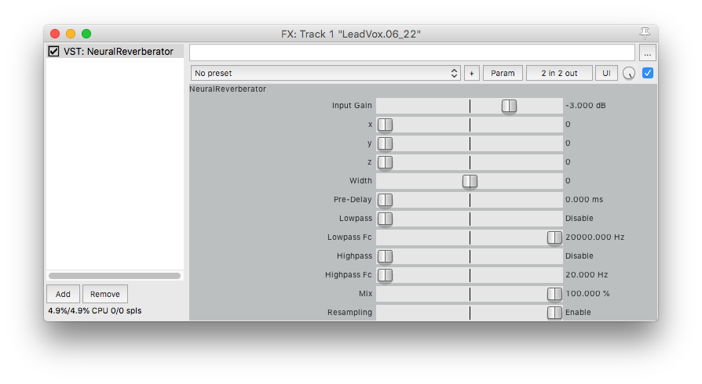
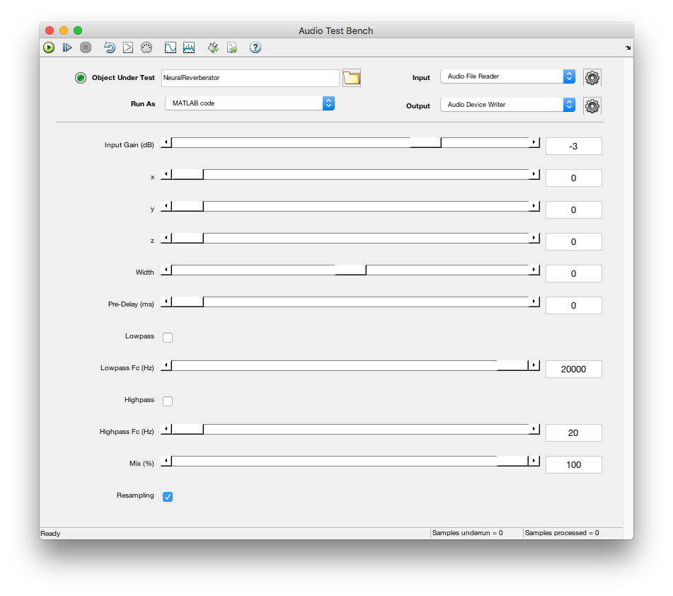
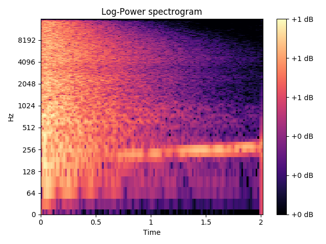

# NeuralReverberator

VST plug-in for Room Impulse Responses synthesis via a spectral autoencoder.



## Usage
You can download the compiled VST plug-in [here]().

Once you have 

## Build
You can optionally build the plug-in from source with MATLAB.
This requires the following Toolboxes:
* [DSP System Toolbox](https://www.mathworks.com/products/dsp-system.html)
* [Audio System Toolbox](https://www.mathworks.com/products/audio-system.html)
* [MATLAB Coder](https://www.mathworks.com/products/matlab-coder.html)

To build the plugin in the `plug-in` directory open `NeuralReverberator.m` and then open the audioTestBench

```matlab
>> audioTestBench NeuralReverberator
```

This should open a window like the one shown below.


You can demo the plug-in as MATLAB code if you would like. Press the plug-in generation button in the top toolbar to bring up the VST generation window.


When you are ready to generate the plug-in press `Validate and generate`. This process will then compile the MATLAB code down to C/C++ code to operate as  VST 2 plug-in. Note that this process can take up 15 minutes to complete. 

## Train
Data preprocessing, training, and output generation is all handled in Python with Keras and librosa. 

The room impulse response dataset to train the autoencoder is not provided due to licesning concerns. Trained models are provided in `train/models/` though. These can be loaded into Keras and used. An encoder and decoder are provided. 

The encoder expects a log-power spectogram of size (513, 128, 1) for channels last configuration. It will then produce a 3 dimensional latent representation of shape (1, 1, 1, 3). These can easily be flattened using `numpy.reshape()`. 

For example, below is the log-power spectra of a ~2 second impulse response.



When passed through the trained encoder it generates a 3 dimentional embedding.

`z = -0.68267184  0.5946066  -0.5709323`

The decoder expects a 3 dimentional latent representation of shape (1, 1, 1, 3) with float values (roughly in the range of -2 to 2) and produces a spectrogram of shape (513, 128, 1) which can be flattened down to (513, 128) and either plotted via `librosa.display.specshow()` or converted back to audio using the `ispecgram()` method located in util.py.

When the above latent representation is passed through the decoder it generates a spectrogram.


Notice that this spectrogram closely follows the characteristics of the input, but has been 'blurred'. This is a well established drawback of naive autoencoders. 